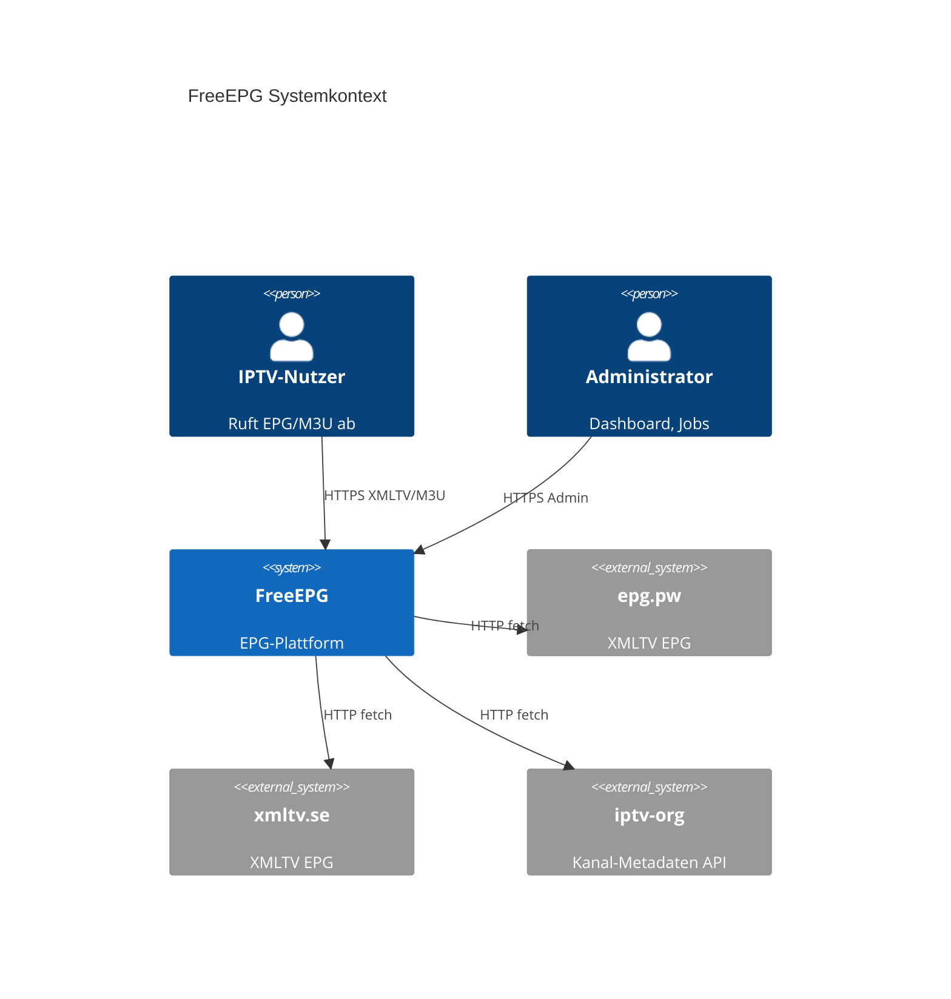

# Architektur-Übersicht FreeEPG

## Einleitung

FreeEPG ist ein TypeScript-Monorepo zur Aggregation, Speicherung und Auslieferung von EPG-Daten im XMLTV-Format. Die Architektur trennt synchrones Request-Handling (Next.js Web) von asynchronen Hintergrundjobs (Worker), nutzt PostgreSQL als System of Record und Redis für Queues sowie Analytics-Pufferung.

**Technologie-Stand (Repository):** Next.js 16.2.10, React 19, Node ≥20 (Docker: 22-alpine), PostgreSQL 16, Redis 7, Turborepo, Drizzle ORM.

## Geltungsbereich

- Monorepo-Struktur `apps/*` und `packages/*`
- Entwicklungs-Stack (`docker-compose.yml`, Port 3000)
- Produktions-Stack (`docker-compose.prod.yml`, Traefik, `free-epg.de`)
- Externe Integrationen (epg.pw, xmltv.se, iptv-epg.org, iptv-org)

## Begriffe und Definitionen

| Begriff | Definition |
|---------|------------|
| Monorepo | Ein Repository mit npm Workspaces und Turbo-Build |
| Standalone Output | Next.js Build-Modus für schlanke Docker-Images |
| Adapter Pattern | `EpgSourceAdapter` für externe EPG-Quellen |
| Job Queue | BullMQ-Queue `epg-jobs` auf Redis |
| XMLTV Merge | Zusammenführung mehrerer Quellen via `mergeXmltvDocs` |
| Trust Boundary | Vertrauensgrenze zwischen Internet, App und Internal Network |

## Verantwortlichkeiten

| Aktivität | Architekt | Entwicklung | Betrieb |
|-----------|:-----------:|:-----------:|:-------:|
| Architektur-Design | A/R | C | C |
| API-Stabilität | C | R | I |
| Infrastruktur-Compose | C | C | R |
| Schema-Evolution | C | R | C |
| Performance/Caching | C | R | C |

## Detailbeschreibung

### Systemkontext

### Monorepo-Komponenten

| Pfad | Paket | Rolle |
|------|-------|-------|
| `apps/web` | `@freeepg/web` | Next.js App Router: UI, REST-API, Middleware, NextAuth |
| `apps/worker` | `@freeepg/worker` | BullMQ Worker, Cron, EPG-Fetch, Analytics-Jobs |
| `packages/db` | `@freeepg/db` | Drizzle Schema, Migrationen, Seed |
| `packages/epg-core` | `@freeepg/epg-core` | XMLTV parse/build, Kanal-Matching |
| `packages/epg-sources` | `@freeepg/epg-sources` | Adapter: iptv-epg.org, epg.pw, xmltv.se; iptv-org API |
| `packages/analytics` | `@freeepg/analytics` | Event-Tracking, Redis-Buffer, DB-Aggregation |
| `packages/m3u-matcher` | `@freeepg/m3u-matcher` | M3U parse, match, enrich |

Build-Orchestrierung: Root `turbo.json`, Scripts in Root `package.json`.

### Deployment-Modell

#### Entwicklung

| Service | Image/Build | Ports | Netzwerk |
|---------|-------------|-------|----------|
| web | `apps/web/Dockerfile` | 3000:3000 | freeepg-internal |
| worker | `apps/worker/Dockerfile` | — | freeepg-internal |
| postgres | postgres:16-alpine | internal | freeepg-internal |
| redis | redis:7-alpine | internal | freeepg-internal |

Volumes: `pgdata`, `redisdata`, `epg-data` (XMLTV-Dateien unter `/data/epg`).

#### Produktion

| Unterschied zu Dev | Detail |
|--------------------|--------|
| Images | Docker Hub `${DOCKERHUB_USER}/freeepg-web`, `freeepg-worker` |
| Edge | Traefik auf externem Netzwerk `proxy-public` |
| TLS | Host-Regel `free-epg.de`, `www.free-epg.de` |
| Internal Net | `freeepg-internal: internal: true` |
| FETCH_ON_START | Default `true` im Worker |

### Hauptdatenflüsse

#### EPG-Land-Abruf (Worker, scheduled)

1. Cron (`CRON_COUNTRY_FETCH`, Default `0 */6 * * *`) enqueued `fetch-all-countries`.
2. Pro Land: Adapter `iptv-epg.org` (priority 4), `epg.pw` (priority 3) und `xmltv.se` (priority 2) werden via `fetchMergedCountryEpg` abgefragt und gemergt (niedrigere Priority gewinnt bei Konflikten).
3. `mergeXmltvDocs` fusioniert Dokumente; `buildXmltv` erzeugt XML.
4. Speicherung: `/data/epg/{cc}.xml` + `.gz`, Metadaten in `generated_files`.
5. Cache-Invalidierung: Redis-Key `freeepg:meta:{CC}` gelöscht.

#### EPG-Land-Abruf (API, on-demand)

1. `GET /api/epg/[country]` prüft Datei via `countryXmlPath`.
2. Falls fehlend: `fetchMergedCountryEpg` synchron, Datei schreiben.
3. Response via `streamFileResponse` mit ETag, optional gzip.

#### M3U-Matching

1. `POST /api/m3u/upload` (JSON URL/content oder multipart file).
2. `parseM3u` → max 5000 Einträge.
3. Katalog aus `channels` (iptv-org Seed), Overrides aus `m3u_match_overrides`.
4. `matchM3uEntries` via `@freeepg/epg-core` (exact_id, fuzzy_name, override, …).
5. Persistenz `m3u_playlists`, `m3u_entries`; EPG via `epg.pw` global lite gefiltert.
6. Response mit `epgUrl`, `reviewUrl`, `downloadUrl`.

#### Interne Analytics

1. Next.js Middleware trackt non-static Requests.
2. Events in Redis-Liste `freeepg:analytics:buffer`.
3. Worker flush alle 30s → `analytics_events`.
4. Tägliche Aggregation → `analytics_daily`; wöchentlicher Cleanup (90 Tage).

#### iptv-org Tages-Sync (Worker, scheduled)

1. Cron (`CRON_IPTV_ORG_GRAB`, Default `0 2 * * *`) enqueued `iptv-org-grab`.
2. `syncIptvOrgChannels` aktualisiert Kanal-Metadaten aus der iptv-org API in `channels`.
3. `refreshPlaylistCaches` schreibt `streams.json` und `country-names.json` nach `/data/epg/playlists/`.
4. Job-Status in `epg_jobs` (`job_type: iptv_org_grab`); manueller Trigger via Admin (`iptvOrg: true`).

### Schnittstellen (API)

| Methode | Pfad | Auth | Beschreibung |
|---------|------|------|--------------|
| GET | `/api/health` | nein | Healthcheck |
| GET | `/api/epg/{country}.xml[.gz]` | nein | Land-EPG |
| GET | `/api/epg/m3u/{id}.xml` | nein | M3U-spezifisches EPG |
| GET | `/api/epg/list/{id}` | nein | Custom-List-EPG |
| POST | `/api/m3u/upload` | nein | M3U Matching |
| GET | `/api/m3u/{id}/download.m3u` | nein | Angereicherte M3U |
| GET | `/api/admin/dashboard` | Session | Admin-Statistiken |
| GET | `/api/admin/analytics` | Session | Analytics-Dashboard |
| POST | `/api/admin/jobs/trigger` | Session | Manuelle Jobs |
| GET | `/api/countries`, `/api/channels` | nein | Metadaten |

Dokumentation im UI: `/docs`, `/docs/api`, `/docs/xmltv`, `/docs/m3u`, `/docs/kodi`.

### Datenmodell (PostgreSQL)

Kerntabellen (Drizzle `packages/db/src/schema.ts`):

| Tabelle | Zweck |
|---------|-------|
| `channels` | Kanal-Katalog (iptv-org), xmltv_id unique |
| `programmes` | Programm-Preview (24h-Fenster, Worker) |
| `epg_sources` | Registrierte Quellen |
| `epg_jobs` | Fetch-Job-Historie |
| `generated_files` | Pfade/Checksums generierter XML |
| `custom_lists` | Personalisierte Kanallisten |
| `m3u_playlists` / `m3u_entries` | Upload-Matching |
| `m3u_match_overrides` | Manuelle Match-Korrekturen |
| `analytics_events` / `analytics_daily` | Interne Statistik |

### Trust Boundaries

| Grenze | Kontrollen |
|--------|------------|
| Internet → Traefik | TLS, Host-Routing |
| Traefik → Web | HTTP intern auf Port 3000 |
| Web/Worker → PostgreSQL | Connection String, Internal Network |
| Web/Worker → Redis | Internal Network, kein Passwort (Prod-Risiko) |
| App → Externe EPG | Outbound HTTPS, User-Agent `FreeEPG/1.0`, Timeouts |

### Architekturentscheidungen

| ADR | Entscheidung | Begründung |
|-----|--------------|------------|
| ADR-001 | Monorepo + Shared Packages | Wiederverwendung epg-core zwischen Web/Worker |
| ADR-002 | File-basierte EPG-Auslieferung | ETag/Streaming, geringe DB-Last für große XML |
| ADR-003 | BullMQ + Redis | Zuverlässige Hintergrundjobs, Retry |
| ADR-004 | NextAuth Credentials | Einfacher Single-Admin ohne User-DB |
| ADR-005 | iptv-org als Kanal-Katalog | Konsistente xmltv_ids für M3U-Match |
| ADR-006 | Interne statt Google Analytics | DSGVO-freundlicher, Self-Hosted |

### Betriebsannahmen

- Docker und Docker Compose verfügbar auf Host.
- Prod: externes Traefik-Netzwerk `proxy-public` existiert.
- Ausreichend Disk für `epg-data` (pro Land XML + gzip).
- Outbound-Internet für EPG-Quellen-Abruf.
- **Offener Punkt:** Horizontale Skalierung (mehrere Web-Replicas) nicht im Compose definiert; geteiltes `epg-data`-Volume erforderlich.

### Integrationen

| System | Protokoll | Richtung |
|--------|-----------|----------|
| iptv-epg.org | HTTPS GET | Outbound |
| epg.pw | HTTPS GET | Outbound |
| xmltv.se | HTTPS GET | Outbound |
| iptv-org.github.io | HTTPS GET | Outbound |
| Traefik | Docker Labels | Inbound |
| Docker Hub | Registry Pull | Inbound (Deploy) |
| GitHub Actions | CI/CD | Build/Push |

## Nachweise und Artefakte

| Artefakt | Pfad |
|----------|------|
| Compose Dev/Prod | `docker-compose.yml`, `docker-compose.prod.yml` |
| Web Dockerfile | `apps/web/Dockerfile` |
| Worker Entry | `apps/worker/src/index.ts` |
| Next Config | `apps/web/next.config.ts` (standalone) |
| Schema | `packages/db/src/schema.ts` |
| EPG Sources | `packages/epg-sources/src/index.ts` |
| Architektur-Diagramm | `architektur.drawio` |
| README | `README.md` |

## Risiken und Kontrollen

| Risiko | Auswirkung | Eintrittswahrscheinlichkeit | Massnahme | Kontrolle | Nachweis |
|--------|------------|----------------------------|-----------|-----------|----------|
| Single Point of Failure Worker | Veraltete EPG | mittel | FETCH_ON_START, Cron 6h, API On-Demand | Job-Monitoring | `epg_jobs` |
| Shared Volume epg-data | Inkonsistenz bei Multi-Replica | niedrig | Single Web-Replica oder shared FS | Deployment-Doc | **Offener Punkt** |
| Sync EPG in API | Request-Latenz | mittel | Worker pre-fetch | Response-Time Analytics | `/api/epg/` route |
| Redis Memory 200MB | Eviction Analytics-Buffer | niedrig | LRU policy, flush every 30s | Redis INFO | `docker-compose.yml` |
| Externe Quelle down | 404 EPG | mittel | Multi-adapter merge | Source status in DB | `epg_sources` |

## Pflegeprozess

1. Bei neuen Services/Routes: Architektur-Diagramm und API-Tabelle aktualisieren.
2. ADR für signifikante Entscheidungen ergänzen.
3. Abgleich mit `gesamtkonzept.md` und `sicherheitsrichtlinien.md` bei Security-Changes.
4. Review bei Major-Upgrades (Next.js, PostgreSQL Major).

## Revisionshistorie

| Datum | Autor/Rolle | Änderung | Anlass |
|-------|-------------|----------|--------|
| 2026-07-12 | Cursor Agent / Dokumentation | Erstversion | Architektur-Dokumentation aus Codebase |
