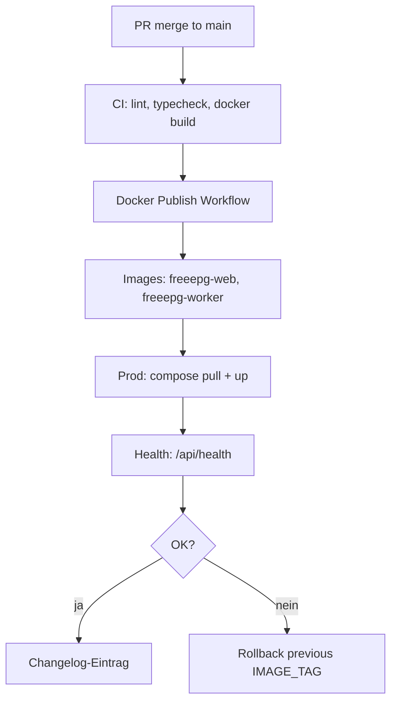

# Changelog (Prozesse & Releases) FreeEPG

## Einleitung

Dieses Changelog dokumentiert relevante Änderungen am FreeEPG-Projekt mit Begründung, Auswirkung, Risiko, betroffenen Komponenten, Prüfung, Freigabe und Rollback-Hinweisen. Es ergänzt die Git-Commit-Historie um compliance- und betriebsrelevante Kontextinformationen.

## Geltungsbereich

- Anwendungsreleases (Web, Worker)
- Infrastruktur- und Compose-Änderungen
- Schema-Migrationen (PostgreSQL)
- Compliance- und Security-relevante Anpassungen
- CI/CD-Pipeline-Änderungen

Nicht im Scope: Jeder Einzel-Commit ohne betriebliche Relevanz.

## Begriffe und Definitionen

| Begriff | Definition |
|---------|------------|
| Release | Deploybare Version (Docker-Tag, Git-Tag `v*.*.*`) |
| Migration | Drizzle SQL-Migration unter `packages/db/drizzle/` |
| Rollback | Rückkehr zur vorherigen Image-Version + ggf. DB-Rollback |
| Breaking Change | Nicht abwärtskompatible API- oder Schema-Änderung |
| IMAGE_TAG | Docker-Image-Tag in Prod (`latest` oder semver) |

## Verantwortlichkeiten

| Aktivität | Product Owner | Entwicklung | Betrieb | Compliance |
|-----------|:-------------:|:-----------:|:-------:|:----------:|
| Changelog-Einträge erstellen | A | R | C | I |
| Release-Freigabe | A | C | R | C |
| Rollback-Entscheidung | A | C | R | I |
| Compliance-Impact bewerten | C | C | I | R |
| Post-Release-Verifikation | I | R | R | I |

## Detailbeschreibung

### Eintrag CHG-2026-005: TV Player für Playlists

| Feld | Inhalt |
|------|--------|
| Datum | 2026-07-12 |
| Version | App-Release (Web) |
| Begründung | Nutzer sollen ausgewählte Playlists direkt im Browser abspielen können, ohne externe IPTV-App |
| Auswirkung | Neue Routen `/playlists/{code}/watch`, `/playlists/world/watch`; API `GET /api/playlists/{code}/entries` (JSON); Stream-Proxy `GET /api/player/stream`; hls.js-Integration; „Abspielen“-Buttons auf Playlist-Karten und Detailseiten |
| Risiko | mittel (Streams von Drittanbietern; Proxy-Bandbreite; Geo-Blocking/CORS können einzelne Sender blockieren) |
| Betroffene Komponenten | `apps/web` (Player-Komponenten, playlists API, stream-proxy) |
| Prüfung | `npm run typecheck -w @freeepg/web`; manuell `/playlists/de/watch`, Senderwechsel, Suche |
| Freigabe | Product Owner |
| Rollback | Vorheriges Web-Image |

### Eintrag CHG-2026-004: Mehrsprachigkeit (Top-20) und Admin aus Navigation

| Feld | Inhalt |
|------|--------|
| Datum | 2026-07-12 |
| Version | App-Release (Web) |
| Begründung | Internationale Nutzer sollen die Oberfläche in den 20 meistgesprochenen Sprachen nutzen können; Admin-Bereich soll nicht öffentlich in der Navigation erscheinen |
| Auswirkung | Neues i18n-Modul (`apps/web/src/lib/i18n/`) mit 20 Locales; Sprachumschalter im Header; Cookie `freeepg_locale`; übersetzte Startseite, Playlists, Header, Footer, Fehlerseiten und Karten; Admin-Link aus Nav entfernt (Route `/admin` bleibt direkt erreichbar) |
| Risiko | niedrig (Client-seitige Übersetzungen; Docs/Admin-UI weiterhin überwiegend Deutsch/Englisch) |
| Betroffene Komponenten | `apps/web` (Layout, Header, Footer, Home, Playlists, CountryCard, PlaylistCard) |
| Prüfung | `npm run typecheck -w @freeepg/web`; manuell Sprachwechsel im Header, Cookie-Persistenz, RTL für Arabisch/Urdu |
| Freigabe | Product Owner |
| Rollback | Vorheriges Web-Image; Cookie `freeepg_locale` optional löschen |

### Eintrag CHG-2026-003: Playlisten weltweit (iptv-org M3U-Katalog)

| Feld | Inhalt |
|------|--------|
| Datum | 2026-07-12 |
| Version | App-Release (Web) |
| Begründung | Nutzer sollen fertige IPTV-Playlists pro Land abrufen können — ergänzt EPG-Feeds um Stream-URLs aus iptv-org |
| Auswirkung | Neue Routen `/playlists`, `/api/playlists`, `/api/playlists/{country}.m3u`; Stream-Cache unter `{EPG_DATA_DIR}/playlists/` (24h TTL); Navigation „Playlisten“ |
| Risiko | mittel (Erstaufruf lädt große iptv-org streams.json; Stream-Verfügbarkeit/Geo-Blocking außerhalb FreeEPG-Kontrolle) |
| Betroffene Komponenten | `apps/web`, `packages/epg-sources`, `packages/m3u-matcher`, `next.config.ts` Rewrites |
| Prüfung | `npm run build -w @freeepg/web`; manuell `GET /api/playlists`, `GET /api/playlists/de.m3u` |
| Freigabe | Product Owner |
| Rollback | Vorheriges Web-Image; Cache-Ordner `playlists/` optional löschen |

### Eintrag CHG-2026-002: Production-Env über stack.env

| Feld | Inhalt |
|------|--------|
| Datum | 2026-07-12 |
| Version | Betriebskonfiguration (kein App-Release) |
| Begründung | Trennung von Dev-`.env` und Prod-Secrets; einheitliches Deployment-Muster mit Traefik-Stacks |
| Auswirkung | `docker-compose.prod.yml` lädt `stack.env` via `env_file`; Compose-Interpolation via `--env-file stack.env`; neue Vorlage `stack.env.example` |
| Risiko | niedrig (Breaking nur für bestehende Prod-Deployments, die bisher `.env` nutzten) |
| Betroffene Komponenten | `docker-compose.prod.yml`, `stack.env.example`, `README.md`, `.gitignore` |
| Prüfung | `docker compose --env-file stack.env.example -f docker-compose.prod.yml config` |
| Freigabe | Betrieb |
| Rollback | `.env` wieder verwenden oder `stack.env` aus Backup; Compose-Befehl mit `--env-file stack.env` |

### Eintrag CHG-2026-001: Initiale Internal-Docs-Struktur

| Feld | Inhalt |
|------|--------|
| Datum | 2026-07-12 |
| Version | Dokumentation (kein App-Release) |
| Begründung | Einführung einheitlicher Compliance-/Architektur-Dokumentation gemäß Team-Regel |
| Auswirkung | Neue Ordnerstruktur `/internal-docs` mit 9 Pflichtdateien; keine Laufzeitänderung |
| Risiko | niedrig (rein dokumentarisch) |
| Betroffene Komponenten | `/internal-docs/**` |
| Prüfung | Abgleich aller technischen Aussagen mit Codebase (Next.js 16, Docker Compose, Drizzle, etc.) |
| Freigabe | Product Owner (organisatorisch) |
| Rollback | Löschen/ Revert des Docs-Commits ohne App-Impact |

### Eintrag CHG-BASELINE: Repository-Baseline (Ist-Stand Code)

| Feld | Inhalt |
|------|--------|
| Datum | 2026-07-12 (Dokumentations-Snapshot) |
| Version | 0.1.0 (package.json Workspace-Versionen) |
| Begründung | Referenz-Baseline für künftige Changelog-Einträge |
| Auswirkung | Beschreibt aktuellen Funktionsumfang ohne neue Deployment |
| Risiko | — |
| Betroffene Komponenten | Gesamtes Monorepo |

**Funktionsumfang Baseline:**

| Feature | Komponente | API/Entry |
|---------|------------|-----------|
| Land-EPG XML/GZIP | web + worker | `GET /api/epg/{country}.xml[.gz]` |
| ETag/304 Caching | web | `lib/xml-response.ts` |
| M3U Upload & Match | web, m3u-matcher | `POST /api/m3u/upload` |
| Custom EPG Lists | web | `custom_lists` DB, `/api/lists` |
| Weltweite Playlists | web, epg-sources, m3u-matcher | `GET /api/playlists`, `GET /api/playlists/{cc}.m3u` |
| Admin Dashboard | web | `/admin`, `/api/admin/*` |
| Interne Analytics | analytics, middleware, worker | Redis buffer → PostgreSQL |
| EPG Fetch Worker | worker | BullMQ, Cron 6h, 20 epg.pw-Länder |
| Channel Seed | db seed | iptv-org API Import |
| Prod Deployment | docker-compose.prod | Traefik, Docker Hub Images |

### Release-Prozess (Soll)



### Rollback-Verfahren Prod

1. Vorherigen stabilen `IMAGE_TAG` in `stack.env` setzen (z. B. semver oder `sha-*`).
2. `docker compose --env-file stack.env -f docker-compose.prod.yml pull && up -d`.
3. DB-Migrationen sind forward-only (Drizzle); Rollback erfordert DB-Restore aus Backup bei breaking migrations.
4. EPG-Volume `epg-data` bleibt erhalten; ggf. manuell konsistent halten.

**Offener Punkt:** Automatisiertes Rollback-Script nicht im Repository.

### Schema-Migrationen

| Migration | Datei | Inhalt |
|-----------|-------|--------|
| 0000_init | `packages/db/drizzle/0000_init.sql` | Vollständiges Initial-Schema (channels, programmes, epg_*, m3u_*, analytics_*) |

Auto-Migration beim Web-Start: `apps/web/docker-entrypoint.sh`.

### Vorlage für künftige Einträge

```markdown
### CHG-YYYY-NNN: Titel

- **Datum / Version:**
- **Begründung:**
- **Auswirkung:**
- **Risiko:** niedrig | mittel | hoch
- **Betroffene Komponenten:**
- **Prüfung:** CI / manuell / Staging
- **Freigabe:**
- **Rollback:** Image-Tag X, Migration Y
```

## Nachweise und Artefakte

| Artefakt | Pfad |
|----------|------|
| Git-Historie | Repository commits |
| CI-Workflows | `.github/workflows/ci.yml`, `docker-publish.yml` |
| Docker Compose | `docker-compose.yml`, `docker-compose.prod.yml` |
| DB-Migrationen | `packages/db/drizzle/` |
| Package-Versionen | `apps/*/package.json`, `packages/*/package.json` |
| README Release-Hinweise | `README.md` |

## Risiken und Kontrollen

| Risiko | Auswirkung | Eintrittswahrscheinlichkeit | Massnahme | Kontrolle | Nachweis |
|--------|------------|----------------------------|-----------|-----------|----------|
| Release ohne Changelog | Compliance-Lücke | mittel | PR-Template mit Changelog-Pflicht | Review | Dieses Dokument |
| Forward-only Migration | Rollback schwierig | niedrig | Backup vor Migration | Betriebs-Checklist | `docker-entrypoint.sh` |
| latest-Tag in Prod | Unerwartetes Deploy | mittel | Pin semver/sha in Prod | Env `IMAGE_TAG` | `.env.example` |
| Worker/Web Version Drift | Inkompatible APIs | niedrig | Gleicher Git-SHA für beide Images | Docker Publish Matrix | `docker-publish.yml` |

## Pflegeprozess

1. Jeder Prod-Release erhält einen CHG-Eintrag innerhalb von 48 Stunden.
2. Breaking Changes explizit markieren und Rollback-Schritte dokumentieren.
3. Compliance-relevante Änderungen cross-referenzieren (`dsgvo.md`, `sicherheitsrichtlinien.md`).
4. Quartalsreview: Baseline-Eintrag aktualisieren wenn Major-Features hinzukommen.

## Revisionshistorie

| Datum | Autor/Rolle | Änderung | Anlass |
|-------|-------------|----------|--------|
| 2026-07-12 | Cursor Agent / Entwicklung | CHG-2026-003 Playlisten weltweit | Feature-Release |
| 2026-07-12 | Cursor Agent / Dokumentation | Erstversion mit Baseline und CHG-2026-001 | Initiale Prozess-Dokumentation |
