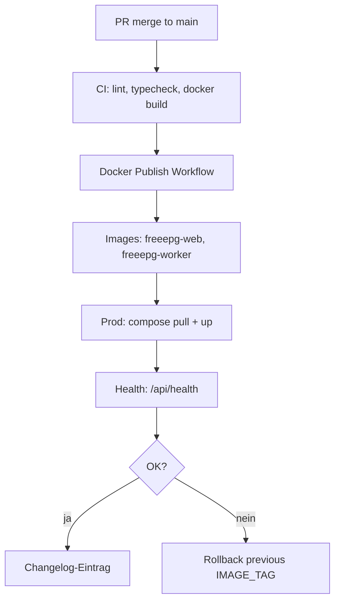

# Changelog (Prozesse & Releases) FreeEPG

## Einleitung

Dieses Changelog dokumentiert relevante Änderungen am FreeEPG-Projekt mit Begründung, Auswirkung, Risiko, betroffenen Komponenten, Prüfung, Freigabe und Rollback-Hinweisen. Es ergänzt die Git-Commit-Historie um compliance- und betriebsrelevante Kontextinformationen.

## Geltungsbereich

- Anwendungsreleases (Web, Worker)
- Infrastruktur- und Compose-Änderungen
- Schema-Migrationen (PostgreSQL)
- Compliance- und Security-relevante Anpassungen
- CI/CD-Pipeline-Änderungen

Nicht im Scope: Jeder Einzel-Commit ohne betriebliche Relevanz.

## Begriffe und Definitionen

| Begriff | Definition |
|---------|------------|
| Release | Deploybare Version (Docker-Tag, Git-Tag `v*.*.*`) |
| Migration | Drizzle SQL-Migration unter `packages/db/drizzle/` |
| Rollback | Rückkehr zur vorherigen Image-Version + ggf. DB-Rollback |
| Breaking Change | Nicht abwärtskompatible API- oder Schema-Änderung |
| IMAGE_TAG | Docker-Image-Tag in Prod (`latest` oder semver) |

## Verantwortlichkeiten

| Aktivität | Product Owner | Entwicklung | Betrieb | Compliance |
|-----------|:-------------:|:-----------:|:-------:|:----------:|
| Changelog-Einträge erstellen | A | R | C | I |
| Release-Freigabe | A | C | R | C |
| Rollback-Entscheidung | A | C | R | I |
| Compliance-Impact bewerten | C | C | I | R |
| Post-Release-Verifikation | I | R | R | I |

## Detailbeschreibung

### Eintrag CHG-2026-025: Admin Job-Ops-Panel und LICENSE (F-001)

| Feld | Inhalt |
|------|--------|
| Datum | 2026-07-24 |
| Version | App-Release (web) |
| Begründung | Tägliche Pipeline: Audit F-001 (fehlende LICENSE); Admin-Job-Historie nur 10 Einträge ohne Filter, Fehlerdetails oder Pagination |
| Auswirkung | `LICENSE` (Unlicense) im Repo-Root; `/api/admin/jobs` mit Pagination, Statusfilter und Aggregat-Zählern; `/admin/jobs` mit Badges, Dauer, Fehler, Auto-Refresh |
| Risiko | niedrig (read-only Job-API; keine Schema-Änderung) |
| Betroffene Komponenten | `LICENSE`, `apps/web/src/lib/admin-jobs-query.ts`, `apps/web/src/app/api/admin/jobs/route.ts`, `apps/web/src/app/admin/jobs/page.tsx` |
| Prüfung | `npm test`; `node scripts/audit-gate.mjs` |
| Freigabe | Product Owner |
| Rollback | Vorheriges Image |

### Eintrag CHG-2026-024: Next.js-Security-Patch, Admin-Rate-Limit und generated_files-Deduplizierung

| Feld | Inhalt |
|------|--------|
| Datum | 2026-07-23 |
| Version | App-Release (web, worker, db) |
| Begründung | Tägliche Pipeline: mehrere High-Severity Next.js-Advisories (≥16.2.11); Admin-Job-Trigger ohne Rate-Limit; `generated_files` wuchs bei jedem Country-Refresh um eine Zeile und UI konnte veraltete Metadaten anzeigen |
| Auswirkung | `next@16.2.11` via Root-Override; `/api/admin/jobs/trigger` limitiert auf 10 Requests/Minute pro Admin-E-Mail (Redis, HTTP 429, Audit-Log bei Limit); Worker nutzt `replaceCountryGeneratedFile`; Lese-Pfade nutzen `getLatestCountryFileMap` |
| Risiko | niedrig (Rate-Limit erfordert Redis — bereits Betriebsvoraussetzung; Replace-Logik ist idempotent; Next-Patch semver-kompatibel) |
| Betroffene Komponenten | `package.json`, `apps/web/package.json`, `apps/web/src/lib/admin-rate-limit.ts`, `apps/web/src/app/api/admin/jobs/trigger/route.ts`, `packages/db/src/generated-files.ts`, `apps/worker/src/index.ts`, `apps/web/src/app/{page,countries/page,api/countries/route}.tsx` |
| Prüfung | `npm test` (web, worker, db, epg-core); `npm run build -w @freeepg/web`; `node scripts/audit-gate.mjs` |
| Freigabe | Product Owner |
| Rollback | Vorheriges Image; Rate-Limit entfällt mit Rollback; `generated_files`-Historie nicht automatisch wiederhergestellt |

### Eintrag CHG-2026-023: Admin Health/Audit, Ländernamen, fast-xml-parser und CI-Audit-Gate

| Feld | Inhalt |
|------|--------|
| Datum | 2026-07-22 |
| Version | App-Release (web, db, epg-core) |
| Begründung | Tägliche Pipeline: 86 fehlende deutsche Ländernamen in der UI; fehlende Admin-Sichtbarkeit für Systemstatus und Audit-Trail; High-Severity Advisory in `fast-xml-parser` (GHSA-8r6m-32jq-jx6q); npm-Audit nicht in CI |
| Auswirkung | `getCountryName` nutzt `Intl.DisplayNames('de')` für alle 106 EPG-Länder; `/admin/health` + `/api/admin/health` (JWT-geschützt) zeigen DB/Redis/Build-Info; `admin_audit_logs`-Tabelle + `/admin/audit` protokolliert Job-Trigger; `fast-xml-parser` ≥5.10.1; CI `scripts/audit-gate.mjs` blockiert High/Critical in Workspace-Direct-Deps |
| Risiko | niedrig (Migration `0001_admin_audit_logs` erforderlich; Audit-Logging blockiert Jobs nicht bei DB-Fehler nur wenn insert fehlschlägt — aktuell synchron vor Response) |
| Betroffene Komponenten | `apps/web/src/lib/countries.ts`, `system-health*.ts`, `admin-audit.ts`, `apps/web/src/app/admin/{health,audit}/`, `apps/web/src/app/api/admin/{health,audit,jobs/trigger}/`, `packages/db/src/schema.ts`, `packages/epg-core/package.json`, `.github/workflows/ci.yml`, `scripts/audit-gate.mjs` |
| Prüfung | `npm test` (22 web, worker, epg-core); `node scripts/audit-gate.mjs` |
| Freigabe | Product Owner |
| Rollback | Vorheriges Image; Migration optional (Tabelle bleibt leer) |

### Eintrag CHG-2026-022: Analytics-Aktivierung, Programme-Cleanup, Admin-Login und EPG-Pfadvalidierung

| Feld | Inhalt |
|------|--------|
| Datum | 2026-07-21 |
| Version | App-Release (web, worker) |
| Begründung | Tägliche Systemprüfung: Analytics-Tracker war implementiert aber nicht an Requests angebunden; Programme-Tabelle wuchs unbegrenzt durch fehlerhafte Cleanup-Logik; NextAuth `signIn`-Seite `/admin/login` fehlte; EPG-Country- und List-Routen validierten Pfade nicht vor Dateizugriff |
| Auswirkung | `proxy.ts` (Next.js 16) ersetzt `middleware.ts`: JWT-Schutz für `/admin/*`, fire-and-forget `trackRequest` für Seiten/API; Worker löscht alle Preview-Programme pro Land vor Neuinsert; `/admin/login` als dedizierte Login-Seite; `isSupportedEpgCountry` / `isValidListId` blockieren Traversal |
| Risiko | niedrig (Analytics-Fehler blockieren Requests nicht; Programme-Cleanup ist idempotent; Admin-Redirect betrifft nur unauthentifizierte Admin-UI) |
| Betroffene Komponenten | `apps/web/src/proxy.ts`, `apps/web/src/lib/analytics-middleware.ts`, `apps/web/src/lib/epg-access.ts`, `apps/web/src/app/admin/login/`, `apps/worker/src/programme-preview.ts`, `apps/worker/src/index.ts` |
| Prüfung | `npm test` (web, worker inkl. neue Tests); `npm run build -w @freeepg/web` |
| Freigabe | Product Owner |
| Rollback | Vorheriges Image; bei Analytics-Problemen `ANALYTICS_ENABLED=false` |

### Eintrag CHG-2026-021: Automatische EPG-Neugenerierung bei veralteter Pipeline-Version

| Feld | Inhalt |
|------|--------|
| Datum | 2026-07-20 |
| Version | App-Release (epg-core, web) |
| Begründung | Production lieferte weiterhin alte `de.xml` mit unnormalisierten epg.pw-Zeiten (`Hofgeschichten` statt `In aller Freundschaft` auf `76748` um 12:54 MESZ); `ensureCountryXml` lieferte gecachte Dateien ohne Versionsprüfung |
| Auswirkung | `EPG_OUTPUT_VERSION=2` in Generator-Metadaten (`FreeEPG/2`); `ensureCountryXml` regeneriert veraltete Dateien beim nächsten API-Abruf; XMLTV-Parser-Fix für `category`/`desc` mit `lang`-Attribut |
| Risiko | niedrig (erster Request pro Land nach Deploy dauert länger) |
| Betroffene Komponenten | `packages/epg-core/src/epg-version.ts`, `xmltv.ts`, `apps/web/src/lib/ensure-epg.ts` |
| Prüfung | Live-Production-Analyse vs. `fetchMergedCountryEpg('DE')`; Unit-Tests `epg-version`, `xmltv` |
| Freigabe | Product Owner |
| Rollback | Vorheriges Image; ggf. manuell `de.xml` löschen und neu generieren |

### Eintrag CHG-2026-020: XMLTV-Kompatibilität für Dispatcharr und Emby

| Feld | Inhalt |
|------|--------|
| Datum | 2026-07-20 |
| Version | App-Release (epg-core, web) |
| Begründung | Kompatibilitätsprüfung für Dispatcharr/Emby: XMLTV-Parser serialisierte `<category lang="de">` und leere `<desc lang="en"/>` als `[object Object]` (~100k fehlerhafte Einträge im DE-Feed) |
| Auswirkung | `textValue()`/`optionalText()` parsen Arrays und attribut-only Elemente korrekt; XML-Ausgabe enthält keine `[object Object]`-Strings mehr; Kategorien und Beschreibungen valide; Dokumentation unter `/docs/dispatcharr` und `/docs/emby` |
| Risiko | niedrig (reines Parsing/Serialisierungs-Fix, keine API-Änderung) |
| Betroffene Komponenten | `packages/epg-core/src/xmltv.ts`, `xmltv.test.ts`, `apps/web/src/app/docs/dispatcharr`, `emby` |
| Prüfung | Unit-Tests Dispatcharr/Emby-Kompatibilität; Live-Check `buildXmltv(fetchMergedCountryEpg('DE'))` → 0× `[object Object]`, 0 orphan programmes |
| Freigabe | Product Owner |
| Rollback | Vorheriges Image; EPG neu generieren |

### Eintrag CHG-2026-019: NDR-Kanal-Alias und lokale XMLTV-Zeitzone für Deutschland

| Feld | Inhalt |
|------|--------|
| Datum | 2026-07-20 |
| Version | App-Release (epg-core, epg-sources, worker) |
| Begründung | Playlist-Kanal `76748` (epg.pw-ID für NDR) und verwandte IDs (`NDR.de`, `NDRFernsehen.de`) zeigten falsche Sendezeiten in IPTV-Playern. UTC-Zeitstempel (`20260720102000 +0000`) wurden als lokale Wandzeit gelesen (10:20 statt 12:20 MESZ); vor der epg.pw-Normalisierung lag der Fehler bei +8h (20:20) |
| Auswirkung | `applyChannelAliases()` kopiert Programme auf iptv-org-Kanal-IDs; `localizeXmltvTimestamps()` formatiert Ausgabe für DE/AT/CH/GB/FR/NL in konfigurierter IANA-Zeitzone; `76748` zeigt z. B. am 20.07.2026 12:20–13:10 „In aller Freundschaft“ |
| Risiko | niedrig (nur Post-Processing nach Merge; bestehende epg.pw-Korrektur bleibt unverändert) |
| Betroffene Komponenten | `packages/epg-core/src/xmltv-dates.ts`, `packages/epg-sources/src/channel-aliases.ts`, `country-timezones.ts`, `merge.ts` |
| Prüfung | Unit-Tests `localizeXmltvTimestamps` (CEST 12:20), `applyChannelAliases`; Live-Check `fetchMergedCountryEpg('DE')` → `76748` und `NDRFernsehen.de` 20260720122000 +0200 |
| Freigabe | Product Owner |
| Rollback | Vorheriges Image; EPG für DE neu generieren (`fetch-country DE`) |

### Eintrag CHG-2026-018: SSRF-Härtung, M3U-Expiry-Cleanup und Drizzle-CVE-Patch

| Feld | Inhalt |
|------|--------|
| Datum | 2026-07-20 |
| Version | App-Release (web, worker, db, analytics, CI) |
| Begründung | Daily Evolution: öffentliche URL-Fetches (M3U-Upload, Stream-Proxy) waren SSRF-anfällig; manuelle M3U-Rematches schrieben global in `m3u_match_overrides`; Audit-Finding F-002 (M3U-Expiry ohne Cleanup); High-CVE in drizzle-orm `<0.45.2` |
| Auswirkung | Neues `url-safety`-Modul (Host-/IP-Blocklisten inkl. IPv6/ULA/CGNAT, DNS-Prüfung, Redirect-Revalidierung, Body-Limit 5 MB); M3U-Upload mit Entry-Limit 5000; Stream-Proxy nutzt sichere Redirect-Kette; manuelle Rematches nur playlist-scoped; Read-Pfade liefern HTTP 410 für abgelaufene Playlists; Worker-Job `m3u-cleanup` (Cron `CRON_M3U_CLEANUP`, Default 03:15 UTC) löscht DB-Zeilen und XML-Artefakte; drizzle-orm einheitlich `0.45.2` via npm overrides; CI führt Unit-Tests aus |
| Risiko | niedrig–mittel (strengere URL-Policy kann interne/private Stream-Hosts blockieren; Cleanup ist irreversibel für abgelaufene Uploads) |
| Betroffene Komponenten | `apps/web/src/lib/url-safety.ts`, `apps/web/src/lib/m3u-access.ts`, M3U-/Stream-API-Routen, `apps/worker/src/m3u-cleanup.ts`, `package.json` overrides, `.github/workflows/ci.yml` |
| Prüfung | `npm test` (epg-core, web, worker); `npm run typecheck -w @freeepg/web`; `npm run typecheck -w @freeepg/worker`; `npm audit` ohne High/Critical |
| Freigabe | Product Owner |
| Rollback | Vorheriges Image; optional Cleanup-Cron deaktivieren (`CRON_M3U_CLEANUP` entfernen / Worker-Rollback) |

### Eintrag CHG-2026-018: globetv.app als EPG-Quelle und 106 unterstützte Länder

| Feld | Inhalt |
|------|--------|
| Datum | 2026-07-19 |
| Version | App-Release (epg-sources, worker, web) |
| Begründung | Nutzerwunsch „Mehr Länder weltweit“; bisher ~83 Regionen, Lücken z. B. Irland, Slowakei, Pakistan, Marokko |
| Auswirkung | Neuer `GlobetvAppAdapter` (priority 5, Basis) mit GitHub-Feeds von globetvapp/epg; `SUPPORTED_EPG_COUNTRIES` auf 106 Regionen erweitert |
| Risiko | mittel (zusätzliche GitHub-Abhängigkeit, größerer Worker-Lauf bei `fetch-all-countries`) |
| Betroffene Komponenten | `packages/epg-sources`, `packages/db/seed.ts` |
| Prüfung | `fetchMergedCountryEpg` für IE/SK/EC; `npm run typecheck` |
| Freigabe | Product Owner |
| Rollback | Vorheriges Image; EPG-Dateien neu generieren |

### Eintrag CHG-2026-017: Zusätzliche EPG-Quelle iptv-epg.org und erweiterte Länderabdeckung

| Feld | Inhalt |
|------|--------|
| Datum | 2026-07-19 |
| Version | App-Release (epg-sources, worker, web) |
| Begründung | Nutzerwunsch „Weitere Quellen nutzen“: bisher nur epg.pw und xmltv.se aktiv; iptv-epg.org bietet ~70 Länder-Feeds |
| Auswirkung | Neuer `IptvEpgOrgAdapter` (priority 4, Basis-Layer); `fetchMergedCountryEpg` zentralisiert Merge; `SUPPORTED_EPG_COUNTRIES` (~83 Regionen); xmltv.se (priority 2) gewinnt bei Konflikten in DACH/EU; Worker/Web nutzen gemergte Quellen |
| Risiko | mittel (mehr externe Abhängigkeiten, längere Fetch-Zeiten für große Feeds wie US) |
| Betroffene Komponenten | `packages/epg-sources`, `apps/worker`, `apps/web`, `packages/db/seed.ts` |
| Prüfung | `npm run typecheck`; Worker-Job `fetch-country` für DE/IT; API `/api/epg/de.xml` |
| Freigabe | Product Owner |
| Rollback | Vorheriges Image; EPG-Dateien unter `/data/epg` neu generieren |

### Eintrag CHG-2026-016: XMLTV-Zeitstempel epg.pw korrigieren (+8h UTC-Fix)

| Feld | Inhalt |
|------|--------|
| Datum | 2026-07-19 |
| Version | App-Release (epg-core, epg-sources, worker) |
| Begründung | GitHub Issue #1: deutsche EPG-Feeds lieferten Sendezeiten 8 Stunden zu spät (`+0000` falsch); Ursache: epg.pw liefert UTC+8-Wandzeiten mit UTC-Suffix |
| Auswirkung | `normalizeEpgPwDocument` zieht 8h von allen epg.pw-Programmzeiten ab; korrekte UTC-Ausgabe in `/api/epg/de.xml` und Rytec-Feeds nach Worker-Neulauf |
| Risiko | niedrig (betrifft nur epg.pw-Quelle; xmltv.se unverändert) |
| Betroffene Komponenten | `packages/epg-core/src/xmltv-dates.ts`, `packages/epg-sources`, `apps/worker` |
| Prüfung | Unit-Tests ARD/RTL-Beispiele aus Issue #1; `npm run test -w @freeepg/epg-core` |
| Freigabe | Product Owner |
| Rollback | Vorheriges Worker/Web-Image; EPG-Dateien unter `/data/epg` neu generieren |

### Eintrag CHG-2026-015: Programm-Suche, EPG-UI und Player-Favoriten

| Feld | Inhalt |
|------|--------|
| Datum | 2026-07-19 |
| Version | App-Release (Web + Worker) |
| Begründung | Nutzer sollen Sendungen finden, Sender-EPG sehen und Lieblingssender im Player speichern können; `programmes`-Tabelle war bisher nicht befüllt |
| Auswirkung | Worker speichert 24h-Programmvorschau; neue Seite `/programmes` mit Suche; Sender-Detail mit Logo/Kategorien/EPG-Panel; TV-Player-Favoriten (localStorage); „Jetzt im TV“ auf Länderseiten; verbesserte Sender-Suche |
| Risiko | niedrig (Favoriten nur clientseitig; Programmdaten abhängig vom EPG-Worker-Lauf) |
| Betroffene Komponenten | `apps/worker`, `apps/web` (programmes, channels, player, countries) |
| Prüfung | `npm run typecheck`; manuell `/programmes`, Sender-Detail, Player-Favoriten |
| Freigabe | Product Owner |
| Rollback | Vorheriges Web- und Worker-Image |

### Eintrag CHG-2026-014: Chromecast und AirPlay im TV Player

| Feld | Inhalt |
|------|--------|
| Datum | 2026-07-13 |
| Version | App-Release (Web) |
| Begründung | Streams auf TV-Geräte senden (Google Cast / Apple AirPlay) |
| Auswirkung | Cast-/AirPlay-Buttons im Player; Google Cast SDK; HLS-Live via Proxy mit absoluten Manifest-URLs für Cast-Geräte |
| Risiko | niedrig (Cast erfordert öffentlich erreichbare Stream-Proxy-URL) |
| Betroffene Komponenten | `TvPlayer.tsx`, `RemotePlaybackControls.tsx`, `chromecast.ts`, `airplay.ts`, `stream-proxy.ts`, i18n |
| Prüfung | Chromecast in Chrome mit Cast-Gerät; AirPlay in Safari/macOS/iOS; `npm run typecheck -w @freeepg/web` |
| Freigabe | Product Owner |
| Rollback | Vorheriges Web-Image |

### Eintrag CHG-2026-013: Header-Navigation aufgeräumt

| Feld | Inhalt |
|------|--------|
| Datum | 2026-07-13 |
| Version | App-Release (Web) |
| Begründung | Überfüllter Desktop-Header mit Überlappungen (Sprachwahl/Nav) |
| Auswirkung | Grid-Layout; Primary-Nav + „Mehr“-Dropdown; Spenden-Buttons aus Desktop-Header entfernt; kompakte Sprachwahl |
| Risiko | niedrig |
| Betroffene Komponenten | `Header.tsx`, `NavMoreMenu.tsx`, `LanguageSwitcher.tsx`, i18n |
| Prüfung | Desktop xl+ ohne Überlappung; Mobile-Menü unverändert vollständig |
| Freigabe | Product Owner |
| Rollback | Vorheriges Web-Image |

### Eintrag CHG-2026-012: TV Player A/V-Synchronisation

| Feld | Inhalt |
|------|--------|
| Datum | 2026-07-13 |
| Version | App-Release (Web) |
| Begründung | Audio und Bild im TV Player liefen auseinander (typisch bei LL-HLS-Modus auf Standard-IPTV-Streams) |
| Auswirkung | IPTV-optimierte HLS.js-Konfiguration (`lowLatencyMode: false`, Puffer/Sync-Tuning); Wiedergabe erst nach `canplay`; sauberes Video-Reset beim Kanalwechsel |
| Risiko | niedrig |
| Betroffene Komponenten | `TvPlayer.tsx`, `hls-config.ts` |
| Prüfung | Live-Stream im Player — Ton/Bild synchron; `npm run typecheck -w @freeepg/web` |
| Freigabe | Product Owner |
| Rollback | Vorheriges Web-Image |

### Eintrag CHG-2026-011: Affiliate-Links Shoop und trade.re

| Feld | Inhalt |
|------|--------|
| Datum | 2026-07-13 |
| Version | App-Release (Web) |
| Begründung | Zusätzliche Affiliate-Partner neben Amazon zur Unterstützung des Projekts |
| Auswirkung | Neue Komponente `AffiliateLinks` (Amazon, Shoop, trade.re) im Footer und Mobile-Menü; URLs in `site.ts`; i18n-Keys `donate.shoop`, `donate.tradere`, `donate.affiliateTitle` in 20 Sprachen; Amazon aus `DonateButton` entfernt (keine Duplikate) |
| Risiko | niedrig |
| Betroffene Komponenten | `AffiliateLinks.tsx`, `Footer.tsx`, `Header.tsx`, `DonateButton.tsx`, `site.ts`, i18n |
| Prüfung | Links im Footer/Mobile-Menü öffnen korrekte URLs mit `rel="sponsored"`; `npm run typecheck -w @freeepg/web` |
| Freigabe | Product Owner |
| Rollback | Vorheriges Web-Image |

### Eintrag CHG-2026-011: Tägliche iptv-org-Aktualisierung (Worker-Cron)

| Feld | Inhalt |
|------|--------|
| Datum | 2026-07-19 |
| Version | App-Release (Worker, Web Admin) |
| Begründung | Kanal-Metadaten und Playlist-Streams sollen täglich automatisch synchronisiert werden; `CRON_IPTV_ORG_GRAB` war in `.env.example` dokumentiert, aber nicht implementiert |
| Auswirkung | Neuer BullMQ-Job `iptv-org-grab` (täglich 02:00 Uhr, konfigurierbar via `CRON_IPTV_ORG_GRAB`); aktualisiert `channels` aus iptv-org API und schreibt `streams.json`/`country-names.json` nach `/data/epg/playlists/`; Admin-Trigger `iptvOrg: true` |
| Risiko | niedrig (idempotenter Upsert; erhöhte Netzwerklast einmal täglich) |
| Betroffene Komponenten | `apps/worker`, `packages/db/src/seed.ts`, `packages/epg-sources`, `apps/web` (Admin), `docker-compose.yml` |
| Prüfung | `npm run typecheck`; Worker-Log `[iptv-org] Sync complete`; manuell Admin-Button „iptv-org Sync“ |
| Freigabe | Product Owner |
| Rollback | Vorheriges Worker-Image; Cron-Variable entfernen oder deaktivieren |

### Eintrag CHG-2026-010: App-Icon und Favicon

| Feld | Inhalt |
|------|--------|
| Datum | 2026-07-13 |
| Version | App-Release (Web) |
| Begründung | Einheitliches Branding in Browser-Tab, Lesezeichen und auf dem Home-Bildschirm |
| Auswirkung | `app/icon.png`, `app/apple-icon.png`, `public/icon.png` — FreeEPG-Icon (Navy/Teal, EPG-Motiv) |
| Risiko | niedrig |
| Betroffene Komponenten | `apps/web` (Metadata via Next.js file convention) |
| Prüfung | Favicon im Browser-Tab nach Deploy sichtbar |
| Freigabe | Product Owner |
| Rollback | Icon-Dateien entfernen |

### Eintrag CHG-2026-009: TV Player in Hauptnavigation

| Feld | Inhalt |
|------|--------|
| Datum | 2026-07-13 |
| Version | App-Release (Web) |
| Begründung | TV Player soll direkt über das Menü erreichbar sein |
| Auswirkung | Neuer Menüpunkt „TV Player“ → `/player` (weltweite Playlist); i18n in 20 Sprachen |
| Risiko | niedrig |
| Betroffene Komponenten | `Header.tsx`, `app/player/page.tsx`, i18n |
| Prüfung | Menüpunkt sichtbar (Desktop + Mobile); `/player` lädt Player |
| Freigabe | Product Owner |
| Rollback | Vorheriges Web-Image |

### Eintrag CHG-2026-008: Responsive Design für Mobile

| Feld | Inhalt |
|------|--------|
| Datum | 2026-07-13 |
| Version | App-Release (Web) |
| Begründung | Layout auf Smartphones und Tablets verbessern — Navigation, Banner, Player und CTAs |
| Auswirkung | `xs`-Breakpoint; Safe-Area-Padding; Mobile-Menü bis `xl` (Fix Lücke lg–xl); Touch-Targets 44px; TV-Player: Video zuerst, Senderliste darunter; Spenden-Buttons gestapelt; Hero-CTAs volle Breite auf Mobile |
| Risiko | niedrig (nur CSS/Layout) |
| Betroffene Komponenten | `globals.css`, Header, Footer, DonateButton, AmazonSupportBanner, HomePageContent, PlaylistWatchView, Cards |
| Prüfung | Manuell auf schmalen Viewports (320–768px); `npm run typecheck -w @freeepg/web` |
| Freigabe | Product Owner |
| Rollback | Vorheriges Web-Image |

### Eintrag CHG-2026-007: Amazon-Unterstützung als Banner

| Feld | Inhalt |
|------|--------|
| Datum | 2026-07-12 |
| Version | App-Release (Web) |
| Begründung | Zusätzliche Unterstützungsmöglichkeit via Amazon-Wunschzettel (`amzn.to/4w1wbC5`) |
| Auswirkung | Globales `AmazonSupportBanner` unter dem Header; Amazon-Button in `DonateButton`; URL in `lib/site.ts` |
| Risiko | niedrig |
| Betroffene Komponenten | `apps/web` (Layout, DonateButton, i18n) |
| Prüfung | Manuell Banner sichtbar, Link öffnet Amazon |
| Freigabe | Product Owner |
| Rollback | Vorheriges Web-Image |

### Eintrag CHG-2026-006: EPG im TV Player

| Feld | Inhalt |
|------|--------|
| Datum | 2026-07-12 |
| Version | App-Release (Web) |
| Begründung | Nutzer sollen beim Abspielen sehen, welches Programm gerade läuft und was als Nächstes kommt |
| Auswirkung | `ChannelEpgPanel` unter dem Video; API `GET /api/channels/{xmltvId}` liefert `current` + `upcoming` aus DB; Fortschrittsbalken für laufende Sendung |
| Risiko | niedrig (EPG nur verfügbar, wenn Worker Programme in DB gespeichert hat) |
| Betroffene Komponenten | `apps/web` (Player, channel-epg lib, channels API) |
| Prüfung | `npm run typecheck -w @freeepg/web`; manuell Sender mit EPG in `/playlists/de/watch` |
| Freigabe | Product Owner |
| Rollback | Vorheriges Web-Image |

### Eintrag CHG-2026-005: TV Player für Playlists

| Feld | Inhalt |
|------|--------|
| Datum | 2026-07-12 |
| Version | App-Release (Web) |
| Begründung | Nutzer sollen ausgewählte Playlists direkt im Browser abspielen können, ohne externe IPTV-App |
| Auswirkung | Neue Routen `/playlists/{code}/watch`, `/playlists/world/watch`; API `GET /api/playlists/{code}/entries` (JSON); Stream-Proxy `GET /api/player/stream`; hls.js-Integration; „Abspielen“-Buttons auf Playlist-Karten und Detailseiten |
| Risiko | mittel (Streams von Drittanbietern; Proxy-Bandbreite; Geo-Blocking/CORS können einzelne Sender blockieren) |
| Betroffene Komponenten | `apps/web` (Player-Komponenten, playlists API, stream-proxy) |
| Prüfung | `npm run typecheck -w @freeepg/web`; manuell `/playlists/de/watch`, Senderwechsel, Suche |
| Freigabe | Product Owner |
| Rollback | Vorheriges Web-Image |

### Eintrag CHG-2026-004: Mehrsprachigkeit (Top-20) und Admin aus Navigation

| Feld | Inhalt |
|------|--------|
| Datum | 2026-07-12 |
| Version | App-Release (Web) |
| Begründung | Internationale Nutzer sollen die Oberfläche in den 20 meistgesprochenen Sprachen nutzen können; Admin-Bereich soll nicht öffentlich in der Navigation erscheinen |
| Auswirkung | Neues i18n-Modul (`apps/web/src/lib/i18n/`) mit 20 Locales; Sprachumschalter im Header; Cookie `freeepg_locale`; übersetzte Startseite, Playlists, Header, Footer, Fehlerseiten und Karten; Admin-Link aus Nav entfernt (Route `/admin` bleibt direkt erreichbar) |
| Risiko | niedrig (Client-seitige Übersetzungen; Docs/Admin-UI weiterhin überwiegend Deutsch/Englisch) |
| Betroffene Komponenten | `apps/web` (Layout, Header, Footer, Home, Playlists, CountryCard, PlaylistCard) |
| Prüfung | `npm run typecheck -w @freeepg/web`; manuell Sprachwechsel im Header, Cookie-Persistenz, RTL für Arabisch/Urdu |
| Freigabe | Product Owner |
| Rollback | Vorheriges Web-Image; Cookie `freeepg_locale` optional löschen |

### Eintrag CHG-2026-003: Playlisten weltweit (iptv-org M3U-Katalog)

| Feld | Inhalt |
|------|--------|
| Datum | 2026-07-12 |
| Version | App-Release (Web) |
| Begründung | Nutzer sollen fertige IPTV-Playlists pro Land abrufen können — ergänzt EPG-Feeds um Stream-URLs aus iptv-org |
| Auswirkung | Neue Routen `/playlists`, `/api/playlists`, `/api/playlists/{country}.m3u`; Stream-Cache unter `{EPG_DATA_DIR}/playlists/` (24h TTL); Navigation „Playlisten“ |
| Risiko | mittel (Erstaufruf lädt große iptv-org streams.json; Stream-Verfügbarkeit/Geo-Blocking außerhalb FreeEPG-Kontrolle) |
| Betroffene Komponenten | `apps/web`, `packages/epg-sources`, `packages/m3u-matcher`, `next.config.ts` Rewrites |
| Prüfung | `npm run build -w @freeepg/web`; manuell `GET /api/playlists`, `GET /api/playlists/de.m3u` |
| Freigabe | Product Owner |
| Rollback | Vorheriges Web-Image; Cache-Ordner `playlists/` optional löschen |

### Eintrag CHG-2026-002: Production-Env über stack.env

| Feld | Inhalt |
|------|--------|
| Datum | 2026-07-12 |
| Version | Betriebskonfiguration (kein App-Release) |
| Begründung | Trennung von Dev-`.env` und Prod-Secrets; einheitliches Deployment-Muster mit Traefik-Stacks |
| Auswirkung | `docker-compose.prod.yml` lädt `stack.env` via `env_file`; Compose-Interpolation via `--env-file stack.env`; neue Vorlage `stack.env.example` |
| Risiko | niedrig (Breaking nur für bestehende Prod-Deployments, die bisher `.env` nutzten) |
| Betroffene Komponenten | `docker-compose.prod.yml`, `stack.env.example`, `README.md`, `.gitignore` |
| Prüfung | `docker compose --env-file stack.env.example -f docker-compose.prod.yml config` |
| Freigabe | Betrieb |
| Rollback | `.env` wieder verwenden oder `stack.env` aus Backup; Compose-Befehl mit `--env-file stack.env` |

### Eintrag CHG-2026-001: Initiale Internal-Docs-Struktur

| Feld | Inhalt |
|------|--------|
| Datum | 2026-07-12 |
| Version | Dokumentation (kein App-Release) |
| Begründung | Einführung einheitlicher Compliance-/Architektur-Dokumentation gemäß Team-Regel |
| Auswirkung | Neue Ordnerstruktur `/internal-docs` mit 9 Pflichtdateien; keine Laufzeitänderung |
| Risiko | niedrig (rein dokumentarisch) |
| Betroffene Komponenten | `/internal-docs/**` |
| Prüfung | Abgleich aller technischen Aussagen mit Codebase (Next.js 16, Docker Compose, Drizzle, etc.) |
| Freigabe | Product Owner (organisatorisch) |
| Rollback | Löschen/ Revert des Docs-Commits ohne App-Impact |

### Eintrag CHG-BASELINE: Repository-Baseline (Ist-Stand Code)

| Feld | Inhalt |
|------|--------|
| Datum | 2026-07-12 (Dokumentations-Snapshot) |
| Version | 0.1.0 (package.json Workspace-Versionen) |
| Begründung | Referenz-Baseline für künftige Changelog-Einträge |
| Auswirkung | Beschreibt aktuellen Funktionsumfang ohne neue Deployment |
| Risiko | — |
| Betroffene Komponenten | Gesamtes Monorepo |

**Funktionsumfang Baseline:**

| Feature | Komponente | API/Entry |
|---------|------------|-----------|
| Land-EPG XML/GZIP | web + worker | `GET /api/epg/{country}.xml[.gz]` |
| ETag/304 Caching | web | `lib/xml-response.ts` |
| M3U Upload & Match | web, m3u-matcher | `POST /api/m3u/upload` |
| Custom EPG Lists | web | `custom_lists` DB, `/api/lists` |
| Weltweite Playlists | web, epg-sources, m3u-matcher | `GET /api/playlists`, `GET /api/playlists/{cc}.m3u` |
| Admin Dashboard | web | `/admin`, `/api/admin/*` |
| Interne Analytics | analytics, middleware, worker | Redis buffer → PostgreSQL |
| EPG Fetch Worker | worker | BullMQ, Cron 6h, 20 epg.pw-Länder |
| Channel Seed | db seed | iptv-org API Import |
| Prod Deployment | docker-compose.prod | Traefik, Docker Hub Images |

### Release-Prozess (Soll)



### Rollback-Verfahren Prod

1. Vorherigen stabilen `IMAGE_TAG` in `stack.env` setzen (z. B. semver oder `sha-*`).
2. `docker compose --env-file stack.env -f docker-compose.prod.yml pull && up -d`.
3. DB-Migrationen sind forward-only (Drizzle); Rollback erfordert DB-Restore aus Backup bei breaking migrations.
4. EPG-Volume `epg-data` bleibt erhalten; ggf. manuell konsistent halten.

**Offener Punkt:** Automatisiertes Rollback-Script nicht im Repository.

### Schema-Migrationen

| Migration | Datei | Inhalt |
|-----------|-------|--------|
| 0000_init | `packages/db/drizzle/0000_init.sql` | Vollständiges Initial-Schema (channels, programmes, epg_*, m3u_*, analytics_*) |

Auto-Migration beim Web-Start: `apps/web/docker-entrypoint.sh`.

### Vorlage für künftige Einträge

```markdown
### CHG-YYYY-NNN: Titel

- **Datum / Version:**
- **Begründung:**
- **Auswirkung:**
- **Risiko:** niedrig | mittel | hoch
- **Betroffene Komponenten:**
- **Prüfung:** CI / manuell / Staging
- **Freigabe:**
- **Rollback:** Image-Tag X, Migration Y
```

## Nachweise und Artefakte

| Artefakt | Pfad |
|----------|------|
| Git-Historie | Repository commits |
| CI-Workflows | `.github/workflows/ci.yml`, `docker-publish.yml` |
| Docker Compose | `docker-compose.yml`, `docker-compose.prod.yml` |
| DB-Migrationen | `packages/db/drizzle/` |
| Package-Versionen | `apps/*/package.json`, `packages/*/package.json` |
| README Release-Hinweise | `README.md` |

## Risiken und Kontrollen

| Risiko | Auswirkung | Eintrittswahrscheinlichkeit | Massnahme | Kontrolle | Nachweis |
|--------|------------|----------------------------|-----------|-----------|----------|
| Release ohne Changelog | Compliance-Lücke | mittel | PR-Template mit Changelog-Pflicht | Review | Dieses Dokument |
| Forward-only Migration | Rollback schwierig | niedrig | Backup vor Migration | Betriebs-Checklist | `docker-entrypoint.sh` |
| latest-Tag in Prod | Unerwartetes Deploy | mittel | Pin semver/sha in Prod | Env `IMAGE_TAG` | `.env.example` |
| Worker/Web Version Drift | Inkompatible APIs | niedrig | Gleicher Git-SHA für beide Images | Docker Publish Matrix | `docker-publish.yml` |

## Pflegeprozess

1. Jeder Prod-Release erhält einen CHG-Eintrag innerhalb von 48 Stunden.
2. Breaking Changes explizit markieren und Rollback-Schritte dokumentieren.
3. Compliance-relevante Änderungen cross-referenzieren (`dsgvo.md`, `sicherheitsrichtlinien.md`).
4. Quartalsreview: Baseline-Eintrag aktualisieren wenn Major-Features hinzukommen.

## Revisionshistorie

| Datum | Autor/Rolle | Änderung | Anlass |
|-------|-------------|----------|--------|
| 2026-07-21 | Cursor Agent / Daily Evolution | CHG-2026-022 Analytics, Programme-Cleanup, Admin-Login, EPG-Validierung | Daily Operational Pipeline |
| 2026-07-20 | Cursor Agent / Entwicklung | CHG-2026-021 EPG-Stale-Refresh + Parser-Fix | Hofgeschichten statt IAF auf 76748 (Production) |
| 2026-07-20 | Cursor Agent / Entwicklung | CHG-2026-020 XMLTV-Kompatibilität Dispatcharr/Emby | `[object Object]` in category/desc |
| 2026-07-20 | Cursor Agent / Entwicklung | CHG-2026-019 NDR-Kanal-Alias und lokale XMLTV-Zeitzone | EPG-Fehlzeit NDRFernsehen.de |
| 2026-07-20 | Cursor Agent / Daily Evolution | CHG-2026-018 SSRF-Härtung, M3U-Cleanup, Drizzle-CVE | Daily Evolution Pipeline |
| 2026-07-12 | Cursor Agent / Entwicklung | CHG-2026-003 Playlisten weltweit | Feature-Release |
| 2026-07-12 | Cursor Agent / Dokumentation | Erstversion mit Baseline und CHG-2026-001 | Initiale Prozess-Dokumentation |
